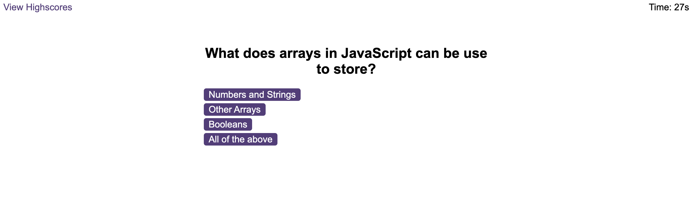

# Javascript-Code-Quiz

## Description

This JavaScript quiz gives the user a time limit to complete multiple-choice questions and the option to record their score and initials, which are subsequently shown on a different page with the highest scores in the game.

## Installation

This app runs in the browser, and features dynamically updated HTML and CSS powered by JavaScript.

- To access the the quiz [follow the link](https://martinokaf.github.io/Javascript-Code-Quiz/).
- Open the link on your preferred web browser.
- Explore the website by clicking the "START" button.

## Usage

The page shows off all of its features. Press 'Start Quiz' to initiate the test. As you proceed through the questions, take care not to miss too many because a false response will subtract 10 seconds from the timer. But make sure you stack up those right answers since they'll also add 5 more seconds to the countdown. After finishing the quiz, you'll be asked to enter your initials, and if you're lucky, your name will appear on the scoreboard. Simply click the buttons underneath the scoreboard to clear it or return to the homepage, and they will function as you would expect. 

## License

MIT License - Please see the Repository for more information

## Credits

Despite being finished independently, the project used the source code from:

- edX Boot Camps LLC
- [JavaScript Array](https://www.javascripttutorial.net/javascript-array-foreach/)